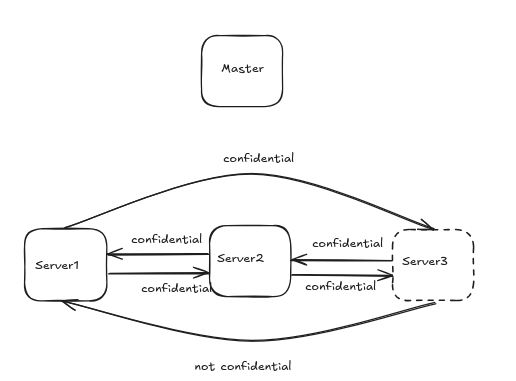

# Byzantine Consensus System Documentation

## System Overview

This system implements a Byzantine fault-tolerant consensus protocol for managing data confidentiality across distributed servers. The architecture consists of a master server (commander) with database access and three slave servers (lieutenants) that rely on the master for information.

## Architecture Components

### Server Roles

#### Master Server (Commander)
- Direct database access
- Responsible for data distribution
- Controls confidentiality flags
- Can be Byzantine 

#### Slave Servers (Lieutenants)
- No direct database access
- Receive data from master
- Share information with other slaves
- Can be Byzantine

### External Components
- Database: Accessible only by master server
- External Party: Potential recipient of non-confidential data

## Consensus Protocol

### Normal Operation (No Byzantine Servers)
1. Master retrieves data from database
2. Master distributes data and confidentiality status to all slaves
3. Slaves exchange received information
4. System reaches consensus based on majority vote
5. Data is shared externally only if consensus determines it's non-confidential

## Byzantine Scenarios

### Scenario 1: Byzantine Slave Server
- Master server is loyal
- One slave server is Byzantine

#### Outcome: **System remains secure**
- Loyal slaves follow commander's original confidentiality flag
  - Byzantine slave's altered confidentiality status is outvoted
  - Consensus maintains data security

### Scenario 2: Byzantine Master Server
- Master server is Byzantine
- All slave servers are loyal
- Outcome: **System fails**
  - Master can send inconsistent confidentiality flags
  - Slaves have no way to verify original confidentiality
  - May lead to unauthorized data exposure
  - Byzantine commander can manipulate final consensus

## System Vulnerability and Solution

### Current Vulnerability:
The system fails when the master server is Byzantine because:
1. It is impossible to verify of master's claims
2. Slaves cannot detect inconsistent information; recursion would help, but an insider master may manipulate the information how they see fit
3. Single point of failure in confidentiality determination

### Proposed Solution: Dual Master Architecture

#### Architecture Modification
- Implement two master servers with database access
- Both masters distribute data independently
- Slaves receive data from both masters

#### Detection Mechanism
1. Compare confidentiality flags from both masters
2. If flags differ, one master is Byzantine. 
3. Check which master has inconsistent values.
4. If masters totally differ, recurse through the process
5. If still unsure, don't send the data

#### Benefits
- Prevents unauthorized data exposure
- Maintains system integrity
- Removes single point of failure

### Example
